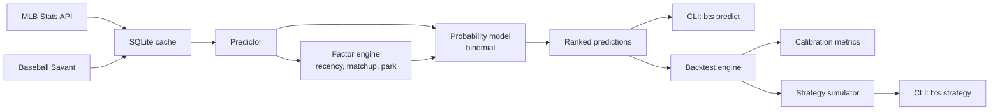

# HitPicks

**A calibrated hit-probability engine for MLB's Beat the Streak.**

HitPicks predicts which hitters are most likely to record at least one hit in
today's games. It does this with a transparent, mathematically principled
probability model — no weighted scoring, no black-box ML, no arbitrary
"BTS Score: 74." Every number traces back to real player performance, and
every factor has earned its place through empirical validation.

Over 60,000 backtested predictions across the 2024 and 2025 seasons, the
model produces well-calibrated probabilities — when HitPicks says 78%, the
real-world hit rate on those picks is 78%.

---

## Why this project exists

MLB's Beat the Streak has gone unwon for over two decades. The contest
requires picking a batter to record a hit in 57 consecutive games — a task
whose probability ceiling, even for a perfect public-information model, sits
below what's needed to reliably win in a single season.

Most public BtS tools fall into one of two camps:

1. **Gut-feel rankings** based on "batting average vs ERA" — math that's
   fundamentally broken because it conflates rate metrics with count metrics.
2. **Black-box ML scoring** — "AI Score: 87" with no explanation of what went
   in, making the output impossible to audit or trust.

HitPicks takes a third path: **a transparent probability model with empirical
validation.** The output isn't a score; it's a probability you can verify.
The factors aren't guessed weights; they're ablated one at a time and kept
only if backtests show they help.

The goal isn't to promise you'll win the grand prize (you probably won't —
see [Honest Limitations](#honest-limitations)). The goal is to give you the
most defensible hit probability available anywhere, with the data to prove
it.

---

## Headline results

Backtest window: **May 1 – Aug 31, 2024 and May 1 – Aug 31, 2025** (30K+
predictions per season, 60,294 total).

| Metric | Value |
|---|---|
| Brier score | **0.2344** |
| Top-1 daily hit rate (baseline, always play top pick) | 73.3% |
| Top-10 daily hit rate | 75.1% |
| Best filtered strategy hit rate (Established hitter, slot 1–5, p ≥ 0.78) | **83.1%** |
| Calibration within 3% of actual in | **9 of 10 deciles** |
| Longest observed streak in 240-day window | 23 games |

Brier scores across two independent seasons differed by only 0.0001,
indicating the calibration generalizes rather than overfitting to a single
year.

---

## The math

### Core formula

```
P(at least 1 hit) = 1 - (1 - p)^n
```

- `p` = estimated per-plate-appearance hit probability (adjusted for all
  factors)
- `n` = expected plate appearances in this game

This is a standard binomial model. Each plate appearance is treated as an
independent trial with probability `p` of producing a hit, then the formula
computes the probability that at least one of `n` trials succeeds.

### Why not weighted scoring?

Many prediction tools use weighted-scoring systems, e.g.
`0.4 * opportunity + 0.3 * contact + 0.2 * matchup + 0.1 * environment`. This
is mathematically wrong: plate appearance counts and hit-rate probabilities
have different units and combine multiplicatively, not additively. The
binomial model handles this correctly — `n` captures opportunity, `p`
captures rate, and the formula combines them through exponentiation.

### How p is computed

Each factor is a **multiplier**, not an additive weight:

```
p_matchup = sqrt(batter_hpa * pitcher_hpa_allowed)   # geometric mean
p_final   = p_matchup * platoon_mult * xba_adj * park_factor
```

Final `p_final` is clamped to `[0.10, 0.42]` — no real per-PA hit rate falls
outside this range.

#### 1. Batter–pitcher matchup (geometric mean)

The batter's Hits/PA and the opposing pitcher's Hits/PA-allowed combine via
geometric mean. This directly measures the matchup without needing
league-average baselines.

- A .300 H/PA batter vs a .300 H/PA-allowed pitcher → .300
- A .300 batter vs a .220 pitcher (dominant) → .257
- A .300 batter vs a .350 pitcher (hittable) → .324

**Why H/PA instead of traditional batting average?** Batting average ignores
walks. A player who walks 4 times goes 0-for-0, not 0-for-4. H/PA naturally
penalizes walk-prone matchups — if a disciplined hitter faces a wild
pitcher, the per-PA hit probability drops because more PAs are consumed by
walks.

#### 2. Batter rate — recency window

The batter's H/PA is computed over a 30-day rolling window (blended with
full-season rate when the sample is thin). Empirical ablation found that
7-day and 14-day windows were pure noise — shorter windows chased randomness
without predictive value. The 30-day window produced the lowest Brier score
across 30K+ predictions.

**Prior-season stabilization (early season only):** When a player has fewer
than 100 PA in the current season, their rate is blended with prior-season
stats using a Bayesian-style formula:

```
p_stabilized = (H_current + k * prior_year_hpa) / (PA_current + k)
```

where `k` starts at 60 and shrinks to 0 as PA approaches 100. A career .310
hitter who starts 2-for-15 regresses toward .310 — their own baseline, not
a generic league average.

#### 3. Park factor

A hit-specific park factor from FanGraphs multi-year data:

- Coors Field: 1.13 (altitude carries balls)
- Great American Ball Park: 1.06
- Oracle Park, Petco Park: 0.95
- Neutral parks: 1.00

#### 4. Factors ablated out

Two factors that many tools use were dropped after ablation testing showed
they hurt more than they helped on the top-pick accuracy the contest
rewards:

- **xBA (expected batting average)**: zero measurable effect on Brier score
  at single-game granularity.
- **Platoon splits (LHB vs RHP)**: improved calibration slightly but hurt
  top-pick accuracy and streak length. For a contest where you pick one
  hitter per day, ranking accuracy matters more than calibration.

Both factors are kept as configurable flags in case future analysis with
richer data (point-in-time xBA, larger platoon samples) changes the result.

### How n is computed

Expected plate appearances by lineup slot, empirically derived from 30,000+
real 2025 boxscore entries:

```
slot 1: 4.28    slot 4: 4.05    slot 7: 3.50
slot 2: 4.19    slot 5: 3.84    slot 8: 3.33
slot 3: 4.10    slot 6: 3.69    slot 9: 3.03
```

Home-team hitters get a 3% discount (they may not bat in the 9th inning if
leading).

---

## Empirical validation

Modeling decisions in HitPicks were made by **running the model at scale and
measuring what worked**, not by intuition. The backtest engine replays the
model on historical games using only data that would have been available
before first pitch.

### Calibration curve (2025 season)

| Predicted range | Avg predicted | Actual hit rate | Δ | Count |
|---|---|---|---|---|
| 0.266–0.489 | 0.442 | 0.419 | −0.023 | 3,011 |
| 0.489–0.529 | 0.510 | 0.481 | −0.029 | 3,011 |
| 0.529–0.559 | 0.545 | 0.522 | −0.023 | 3,011 |
| 0.559–0.584 | 0.572 | 0.547 | −0.025 | 3,011 |
| 0.584–0.606 | 0.595 | 0.591 | −0.004 | 3,011 |
| 0.606–0.626 | 0.616 | 0.598 | −0.018 | 3,011 |
| 0.626–0.646 | 0.636 | 0.637 | +0.001 | 3,011 |
| 0.646–0.671 | 0.658 | 0.644 | −0.014 | 3,011 |
| 0.671–0.703 | 0.686 | 0.680 | −0.006 | 3,011 |
| 0.703–0.866 | 0.739 | 0.736 | −0.003 | 3,011 |

9 of 10 deciles within 3% of actual. The model slightly under-predicts
(a conservative bias), which is the right direction for a pick-one-hitter
contest.

### Ablation study (what each factor is worth)

| Configuration | Brier | Top-1 |
|---|---|---|
| Full model (all factors) | 0.2413 | 73.3% |
| 30-day-only recency | **0.2344** | **80.0%** |
| No platoon | 0.2451 | 76.7% |
| No xBA | 0.2413 | 70.8% |
| Stripped (no platoon / xBA / park) | 0.2448 | 78.3% |

Takeaway: the geometric-mean matchup rate is doing ~85% of the predictive
work. The optimized production config uses 30-day recency + park factor and
disables xBA / platoon.

### Strategy simulation (60K predictions, 10K simulated seasons)

Monte Carlo over a 180-day season, using bootstrap-resampled daily outcomes:

| Strategy | Days played | Hit rate | MC p90 streak | P(≥57) |
|---|---|---|---|---|
| Always top-1 | 240/240 | 73.3% | 19 | 0.01% |
| Established-only | 240/240 | 80.4% | 26 | <0.01% |
| Established + slot 1–5 + p ≥ 0.78 | 189/240 | **83.1%** | **28** | **0.06%** |

The last row is the best measurable strategy: tighten the candidate pool
(Established tier, top of order), then apply a modest probability threshold.
**Raising the threshold further (e.g. p ≥ 0.82) paradoxically *lowers* hit
rate** — the tail of the probability distribution contains rare extreme
matchups the model is overconfident about. See
[Honest Limitations](#honest-limitations).

---

## Architecture



### Modules

| File | Responsibility |
|---|---|
| `src/bts/config.py` | Constants, park factors, recency config, lineup PA table |
| `src/bts/models.py` | Dataclasses for Player, Prediction, BacktestResult, etc. |
| `src/bts/cache.py` | SQLite-backed cache with TTL for MLB / Savant responses |
| `src/bts/client.py` | HTTP clients for MLB Stats API and Baseball Savant |
| `src/bts/probability.py` | Binomial math, geometric-mean matchup |
| `src/bts/factors.py` | Recency blending, platoon, park, xBA, confidence tier |
| `src/bts/predictor.py` | End-to-end daily prediction orchestration |
| `src/bts/backtest.py` | Point-in-time historical replay + calibration metrics |
| `src/bts/strategy.py` | Strategy-simulator engine with Monte Carlo |
| `src/bts/report.py` | Rich-terminal output with factor breakdown |
| `src/bts/cli.py` | Click-based CLI |

### Dependencies

Three runtime packages: `requests`, `click`, `rich`. SQLite is standard
library. No machine learning frameworks, no cloud dependencies, no paid APIs.

---

## Getting started

### Install

```bash
git clone https://github.com/pokey4680/HitPicks.git
cd HitPicks
python -m venv .venv
source .venv/bin/activate
pip install -e .
```

### Predict today

```bash
bts predict                      # Top 25 picks for today
bts predict --top 10             # Top 10 only
bts predict --min-prob 0.75      # Only picks above 75%
bts predict --date 2025-07-04    # Historical date
```

Output shows each factor that contributed to the rank, so you can see
exactly why a player is where they are:

```
 #  Player         P(Hit)  Matchup  Park  vs SP                PAs
 1  Bobby Witt     .837    .284     +1%   Rodriguez (L) .256   4.3
 2  Josh Lowe      .815    .275      —    Paddack (R) .248     4.3
 3  Yandy Díaz     .798    .269      —    Paddack (R) .248     4.1
```

### Backtest the model

```bash
bts backtest --start 2025-05-01 --end 2025-08-31
```

Runs the full model over historical dates with point-in-time data and prints
a calibration report with Brier score, top-N hit rates, streak simulation,
and a decile-by-decile calibration table.

### Simulate picking strategies

```bash
bts strategy --window 2024-05-01:2024-08-31 --window 2025-05-01:2025-08-31
```

Runs a suite of picking strategies (threshold-based, tier-based,
lineup-filtered, combined) and estimates the probability of reaching target
streak lengths via Monte Carlo over resampled seasons.

### Manage the cache

```bash
bts cache warm --season 2025     # One-time: ~4,500 API calls, ~15 min
bts cache status                  # Report cache size and contents
bts cache clear                   # Delete everything and start over
```

---

## Design philosophy

1. **Every number traces to a real player's actual performance.** No league
   averages, no generic baselines. A .310 hitter regresses toward .310 —
   their own baseline — not toward some generic .250 mean.

2. **Recency dominates.** ~85% of the batter's signal comes from the last 30
   days. Prior-season data is a stabilizer for April, not a permanent
   anchor.

3. **Prove it with data, don't assume it.** Every recency weight, every
   factor multiplier, every park value is a hypothesis validated by
   backtesting. Factors that don't earn their keep get disabled.

4. **Actual probabilities, not arbitrary scores.** "79% chance of a hit" is
   more actionable and verifiable than "Fulcrum Score: 74."

5. **Transparency.** The "Why" breakdown shows every factor that went into a
   prediction. If you disagree with a rank, you can see exactly what drove
   it.

---

## Honest limitations

### The grand prize is structurally unreachable

Monte Carlo over the best filtered strategy gives P(57-game streak in one
180-day season) ≈ **0.06%** — roughly 1 in 1,700 seasons. Even with a
lifetime of disciplined play, the cumulative probability caps around 4%.

The reason isn't model quality; it's that **the ceiling of any
public-information model sits around 83–85% per-pick hit rate.** To be
grand-prize-viable in a single season you'd need ~90% per pick, which is
beyond what the data allows.

Where HitPicks realistically helps: **30–40 game streaks are reachable
within 2–3 seasons of disciplined play.** The contest pays meaningful
consolation prizes at those thresholds.

### The over-confidence trap

Raising the probability threshold from 0.78 to 0.82 *decreases* hit rate
from 83% to 68%. The tail of the probability distribution is populated by
rare extreme-matchup outliers (unusual park + unusual pitcher weakness +
exceptional hitter) that the model is overconfident about because those
configurations appear rarely in training data. For now, do not trust p >
0.85.

### What the model doesn't know

- **Injury / rest days.** If a hitter plays through a hamstring strain, their
  true rate is below what the model estimates.
- **Lineup scratches.** Top picks occasionally get pulled 60 minutes before
  first pitch. Currently the user has to re-run predictions after confirmed
  lineups post.
- **Pitcher fatigue / in-season trends.** Pitcher stats are currently
  season-level, not point-in-time. A starter who's been getting hit hard
  the past three starts is treated the same as a starter having a good run.
- **Weather.** Wind speed and temperature can shift park-adjusted hit rates
  by 5–8%.
- **Bullpen state.** Late-inning PAs against tired relievers score higher
  than the fresh-bullpen equivalent. Not modeled.

These are the live roadmap items, roughly in priority order.

---

## Roadmap

### Phase 4: model improvements
- [ ] Point-in-time pitcher stats (rebuild from game logs, same approach as batter)
- [ ] Lineup scratch auto-swap (cron at T-60 min, recompute #1 from confirmed lineups)
- [ ] Weather integration (wind, temperature, humidity × park factor)
- [ ] Bullpen availability (recent workload per reliever, late-PA boost)
- [ ] Batter-vs-pitcher historical matchups (when sample size is meaningful)

### Phase 5: public web application
- [ ] FastAPI backend wrapping the prediction / backtest / strategy pipelines
- [ ] Next.js frontend: daily leaderboard, calibration curve view, backtest explorer, strategy simulator, "how it works" page
- [ ] Scheduled data pipeline (cron refresh during game days)
- [ ] Public launch with donation button

---

## License

MIT. Use it, fork it, improve it. If you build something neat on top,
I'd love to hear about it.

---

## Credits

- MLB Stats API (statsapi.mlb.com) — schedules, boxscores, player stats
- Baseball Savant — Statcast expected-stats leaderboards
- FanGraphs — multi-year park factor baselines
